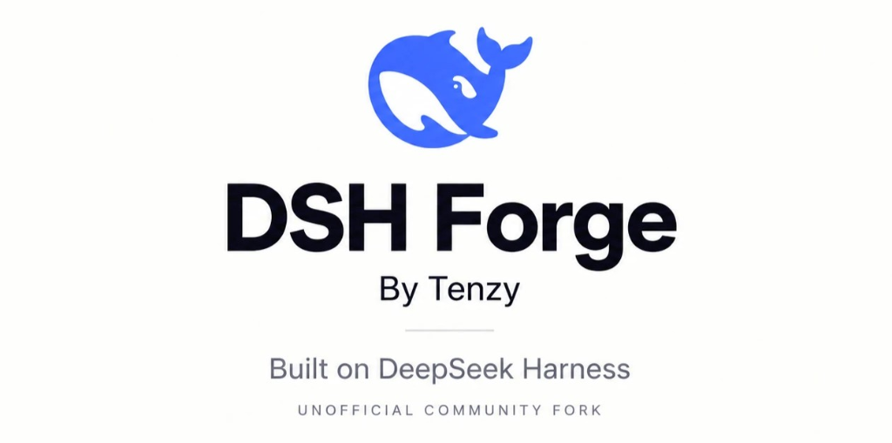

# DSH Forge



DSH Forge is an unofficial community fork of [DeepSeek Harness](https://github.com/deepseek-ai/deepseek-harness) created by Tenzy. It is not an official DeepSeek product, is not maintained or endorsed by DeepSeek AI, and is not the official DeepSeek Harness distribution.

## Developer preview

DSH Forge is in _developer preview_ and iterating rapidly. **THERE WILL BE COMPATIBILITY-BREAKING CHANGES.**

Review the [safety notice](SAFETY.md) before running the project.

## What is DSH Forge?

DSH Forge builds on DeepSeek Harness's everything-is-a-plugin architecture, powered by [Cordis](https://github.com/cordiverse/cordis) and originally created by upstream DeepSeek Harness. The fork explores desktop enhancements, refined model controls, and reliability improvements while keeping the underlying plugin spine.

## Run

### Install DSH Forge

DSH Forge is packaged as a standalone desktop application for Windows x64. The desktop installer bundles its required runtime, so you do not need Node.js, pnpm, or Git installed on your system.

#### Windows x64

**[Download DSH Forge for Windows x64](https://github.com/TenzyZ/deepseek-harness-forge/releases/download/dsh-forge-v0.1.3-alpha.2/dsh-forge-0.1.3-alpha.2-win-x64.exe)**

View release notes and checksums on the [GitHub Releases page](https://github.com/TenzyZ/deepseek-harness-forge/releases/tag/dsh-forge-v0.1.3-alpha.2).

1. Download `dsh-forge-0.1.3-alpha.2-win-x64.exe` using the direct download link above.
2. Double-click the downloaded `.exe` installer.
3. Complete the installer prompts.
4. Launch DSH Forge from your Start menu or desktop shortcut.
5. Configure a model provider and API key in **Settings → Models**.
6. Start using DSH Forge.

This is an alpha Developer Preview build. The current Windows installer uses a local-test signing certificate that is not publicly trusted, so Windows may display a publisher or security warning. Do not install the DSH Forge local test certificate into your Trusted Root store.

## First launch

When you launch DSH Forge for the first time, model requests require at least one configured provider credential. Open **Settings → Models** to configure your credentials. Supported providers include DeepSeek, other built-in providers, and custom OpenAI- or Anthropic-compatible endpoints. For more details on configuring models, see the [model configuration guide](docs/user/guide/providers.md).

## What Forge changes

DSH Forge introduces several focused enhancements across desktop, web, and core runtime layers:

- **Windows release identity (Desktop-only):** Provides dedicated Windows Forge application metadata, app icon, and native window title.
- **DSH Forge branding (Desktop-only):** Displays DSH Forge hero attribution in the desktop application header.
- **Auto Mode permission presets (Desktop-only):** Adds streamlined permission presets for local desktop operation.
- **Reasoning-effort controls (shared Web UI):** Adds reasoning effort configuration in Models settings for pi-ai providers.
- **Settings registration watcher fix:** Resolves an internal reliability issue by ensuring registration watchers quiesce on disposal.

## Existing DeepSeek Harness users

DSH Forge and upstream DeepSeek Harness both use `@deepseek-ai/dsh-home-paths` to resolve the harness configuration directory via `$DSH_HOME`, defaulting to `~/.dsh`. Settings, credentials, attachments, and session data stored in `~/.dsh` may therefore be shared between upstream and Forge installations.

If you want complete separation between your upstream DeepSeek Harness data and DSH Forge, launch Forge with an explicit `DSH_HOME` environment variable pointing to a different directory (for example, `DSH_HOME=~/.dsh-forge`). Forge does not implement automatic user-data isolation.

## Build from source (advanced)

Building from source is intended for contributors and developers modifying DSH Forge. The source workflow runs the development Web UI rather than the packaged Windows Desktop application.

### Run from source

1. **Check Node.js.** Verify your installed Node.js version:

   ```sh
   node --version
   ```

   DSH Forge supports Node.js versions matching `^22.19.0 || >=24.0.0`. In plain language, Node.js 22.19 or higher on the 22.x line is supported, Node.js 23 is unsupported, and Node.js 24 or higher is supported. We recommend Node.js 24 LTS for the simplest setup. If Node.js is missing or unsupported, install the LTS release from [https://nodejs.org/](https://nodejs.org/), reopen your terminal if necessary, and recheck `node --version` before continuing.

2. **Check Git.** Verify that Git is installed on your system:

   ```sh
   git --version
   ```

   If Git is not installed, download and install it from the official Git site at [https://git-scm.com/install/](https://git-scm.com/install/). After installation, reopen your terminal if necessary and rerun `git --version` to confirm.

3. **Prepare pnpm.** DSH Forge pins package management to `pnpm@11.7.0`. On Node.js 24 LTS, enable Corepack:

   ```sh
   corepack enable
   ```

   If Corepack is unavailable or not bundled with your Node.js distribution, install the pinned pnpm version globally:

   ```sh
   npm install -g pnpm@11.7.0
   ```

4. **Clone the repository.** Clone the DSH Forge repository and enter the project directory:

   ```sh
   git clone https://github.com/TenzyZ/deepseek-harness-forge.git
   cd deepseek-harness-forge
   ```

   Once inside the directory, verify that pnpm resolves to version 11.7.0:

   ```sh
   pnpm --version
   ```

5. **Install dependencies.** Install all workspace dependencies:

   ```sh
   pnpm install
   ```

6. **Build repository artifacts.** Compile the TypeScript packages and generate runtime artifacts:

   ```sh
   pnpm run build
   ```

   `pnpm run build` prepares the repository artifacts. `pnpm dsh web` uses those built artifacts without rebuilding.

7. **Launch the Web UI.** Start the Web UI server using the built artifacts:

   ```sh
   pnpm dsh web
   ```

   The server starts at `http://127.0.0.1:3080` by default and normally opens in your default browser. To start the server without automatically opening a browser, pass `--no-open`:

   ```sh
   pnpm dsh web --no-open
   ```

   For more details on using the interface, see the [Web UI guide](docs/user/guide/index.md).

## What's next?

DSH Forge is actively evolving. More Forge-specific features and desktop improvements will be added in upcoming releases.

Have a feature request, improvement idea, or something you'd like changed? Reach me through my portfolio: [tenzy.dev](https://tenzy.dev)

## Built on DeepSeek Harness

DSH Forge is built on the [DeepSeek Harness](https://github.com/deepseek-ai/deepseek-harness) open-source project created by DeepSeek AI, powered by [Cordis](https://github.com/cordiverse/cordis) with design described in [_A Programming Paradigm for Spatiotemporal Composability_](https://arxiv.org/abs/2608.25512).

Documentation for upstream DeepSeek Harness is available at [https://deepseek-harness.github.io/deepseek-harness/](https://deepseek-harness.github.io/deepseek-harness/). Third-party dependencies and notices are listed in [THIRD_PARTY_NOTICES.md](THIRD_PARTY_NOTICES.md).

## Development

See the [development guide](docs/development.md) and [architecture documentation](docs/architecture.md) for contributor setup, project structure, and build commands.

For agent guidelines and repository rules, follow [AGENTS.md](AGENTS.md).

## Contributing

See [CONTRIBUTING.md](CONTRIBUTING.md).

## License

[MIT](LICENSE)

Third-party dependencies and their licenses are disclosed in [THIRD_PARTY_NOTICES.md](THIRD_PARTY_NOTICES.md).
